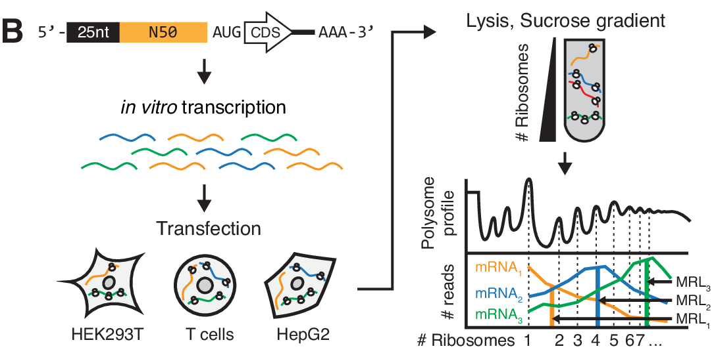
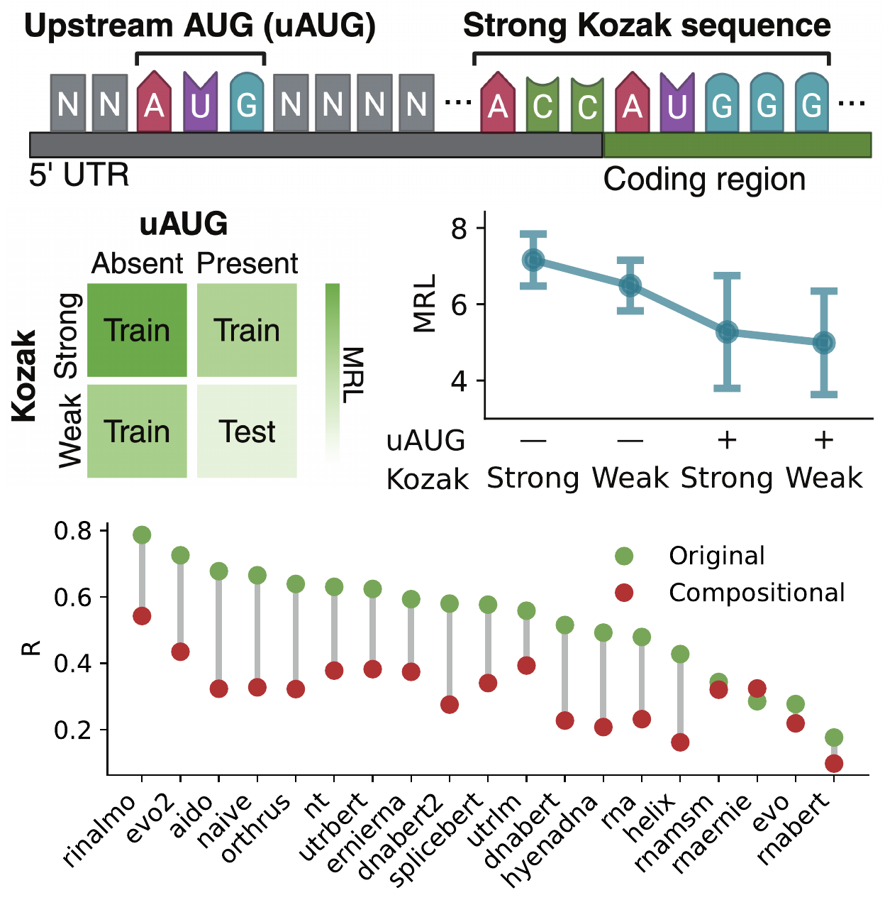
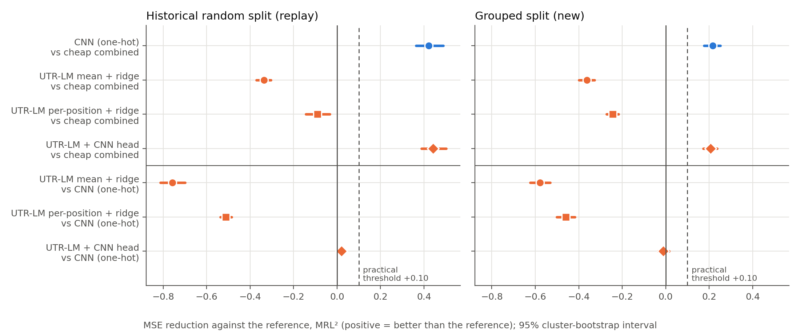
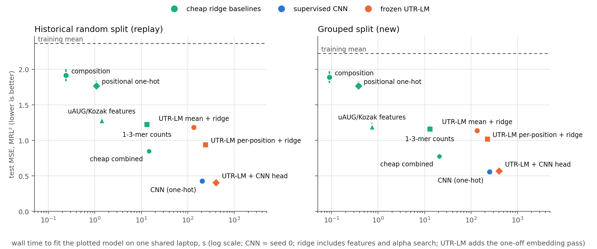
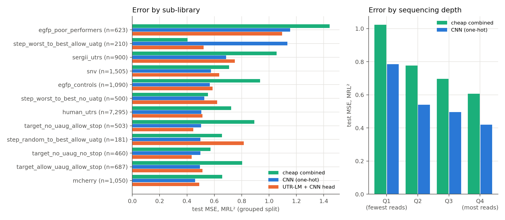
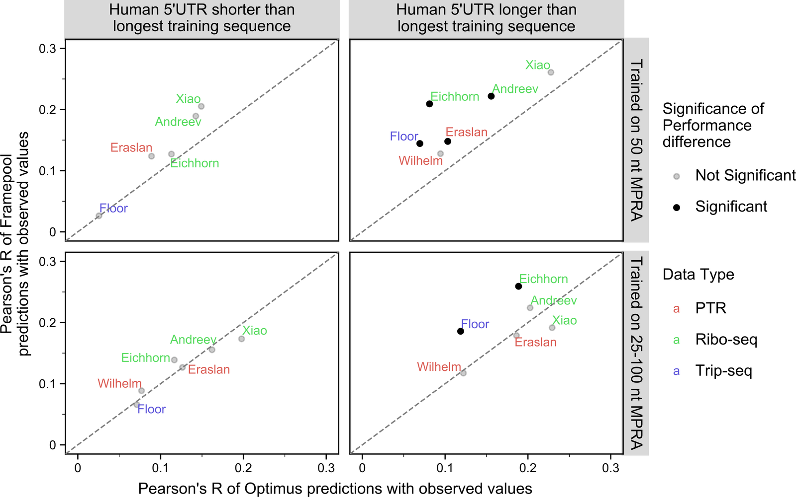

You have a 5′UTR reporter library with measured mean ribosome load (MRL, the average number of ribosomes on each mRNA molecule) and want to predict MRL for sequences you have not made yet. The options are ridge regression on cheap sequence features, a small convolutional neural network (CNN) trained on your labels, and a frozen RNA language-model representation (weights not updated) with a trained head. I compared them on the 100,017 designed 5′UTRs of [Sample et al. (2019)](https://pmc.ncbi.nlm.nih.gov/articles/PMC7100133/), measured by polysome profiling of an eGFP reporter in HEK293T cells and processed by [mRNABench](https://pmc.ncbi.nlm.nih.gov/articles/PMC12265608/).

A grouped split keeps families of related sequences on one side of the train/test boundary. On it, the one-hot CNN had a test mean squared error (MSE, in MRL²) of 0.560 against 0.776 for the best cheap baseline, a reduction of +0.216 [+0.176, +0.252]. Precision at 1% capacity is the share of the 150 top-ranked test sequences that are high-MRL (at or above the 90th percentile of training labels). The CNN found 86 and the cheap baseline 83; the difference, +0.020 [−0.088, +0.132], is not supported, and the interval is too wide to show that the two are equal. Frozen UTR-LM embeddings made no supported difference as CNN input and were worse than cheap features with a ridge head.

These results are exploratory: one unreplicated assay, about 70,000 training labels, one frozen checkpoint, one laptop. The [code archive](../downloads/utr-baselines.zip) reruns everything in about 57 minutes; the [results archive](../downloads/utr-baselines-results.zip) holds the outputs and logs behind every number.

| Your situation | What the evidence supports | Key numbers | Main caveat | Evidence |
|---|---|---|---|---|
| New sequence families; you need MRL values | One-hot CNN | Grouped MSE 0.560 vs 0.776; reduction +0.216 [+0.176, +0.252] | Seed-0 model; one 49-record family failed badly | Tables 2, 3; Figure 5 |
| New sequence families; you will test the top 1% | No supported difference between the CNN and cheap combined ridge; ridge is the cheaper option | P@150 0.573 vs 0.553; gain +0.020 [−0.088, +0.132] | Interval allows a CNN gain of about 0.1 or a similar loss; CNN seeds spanned 0.533–0.580 | Table 3 |
| Candidates are close relatives of training sequences | One-hot CNN on both metrics | Random split: MSE +0.422 [+0.363, +0.488]; precision +0.207 [+0.124, +0.292] | 79.3% of that test set has a relative in training; different test population | Table 3 |
| Considering frozen UTR-LM features | Not with a ridge head; with a CNN head, no supported difference from one-hot | Per-position ridge vs cheap −0.244 [−0.272, −0.216]; UTR-LM + CNN vs CNN −0.010 [−0.034, +0.016] | One checkpoint, frozen only | Table 3; Figure 3 |
| Only a CPU and seconds of fitting | Cheap combined ridge | 20.7 s including alpha search; 0.45 GB peak memory | Higher MSE than the CNN; times from a shared laptop | Table 2; Figure 4 |
| You need single-variant effects | Nothing tested here | One declared SNV pair: measured +0.66, predicted −0.06 to +0.32 | One pair is an example, not an evaluation | Table 4 |
| Your assay, cells, chemistry or label count differ | Outside the tested scope | – | Run a grouped comparison on your own labels | Limits section |

*Table 1. Decision summary. P@150 is precision at 150, the share of high-MRL sequences among the 150 top-ranked. Grouped-split numbers unless stated; 95% cluster-bootstrap intervals; all results exploratory and measured with about 70,000 training labels.*

## The assay measures ribosome loading on one reporter, not protein output

In the Sample et al. assay, in vitro transcribed (IVT) reporter mRNAs are transfected into cells, the lysate is separated on a sucrose gradient into fractions carrying different numbers of ribosomes, and each fraction is sequenced. For each 5′UTR, MRL is the sum over fractions of its relative read count in each fraction multiplied by that fraction's ribosome number ([Sample et al. 2019](https://pmc.ncbi.nlm.nih.gov/articles/PMC7100133/); Figure 1).



*Figure 1. How a polysome-profiling reporter assay turns reads across ribosome fractions into MRL; this panel shows a 2024 library with the same 25 nt + 50 nt construct, not the 2019 data used here. Adapted (cropped) from [Castillo-Hair et al. 2024](https://pmc.ncbi.nlm.nih.gov/articles/PMC11189900/), Fig. 1b, [CC BY 4.0](https://creativecommons.org/licenses/by/4.0/).*

Each designed-library record is a 25-nt defined leader, a 50-nt insert and the eGFP coding sequence, measured in HEK293T cells 12 hours after transfection ([GEO GSM3130443](https://www.ncbi.nlm.nih.gov/geo/query/acc.cgi?acc=GSM3130443)). The inserts include 50-nt fragments of 35,212 human 5′UTRs, 3,577 ClinVar variants, genetic-algorithm designs and step-wise evolution trajectories in which every intermediate was synthesised (80 trajectories, 7,526 UTRs). The `mcherry` sub-library label records design origin: the whole designed library was cloned into the same eGFP vector. Two of the 13 labels, `sergii_utrs` and `egfp_poor_performers`, have no documented definition. The library was measured once, with no duplicate ([GEO GSE114002](https://www.ncbi.nlm.nih.gov/geo/query/acc.cgi?acc=GSE114002)), so there is no replicate-based ceiling on achievable accuracy. The sources do not state its RNA chemistry.

Only the insert varies: the other 805 nt of each 855-nt processed record are identical in all 100,017 records. A replay of an earlier full-sequence composition control from [rewire-benchmarks](https://github.com/rewire-bio/rewire-benchmarks/blob/ca73fa47136d182f2d4ddb083d084712198fc0e2/research/local-runs-2026-09-20/README.md) therefore gives near-identical predictions to insert-only composition (maximum difference below 0.001 MRL; test MSE 1.914 on the random split). Every method below uses the insert alone.

## Three kinds of model were fitted to the same 50 nucleotides

**Cheap ridge baselines.** Ridge regression on nucleotide composition; counts of all 1- to 3-mers (84 features); position-specific one-hot (200 features); annotation features (upstream AUGs [uAUGs] and their frame, uAUG-stop pairs, stop codons, Kozak context); and `cheap_combined`, which concatenates the last three. The reference is the cheap model with the lowest validation MSE: `cheap_combined` on both splits.

**Supervised CNN.** An Optimus 5-Prime-style network (three convolutional layers of 120 width-8 filters, a 40-unit dense layer) trained from scratch on one-hot inserts. Headline numbers use seed 0 of three, fixed in advance.

**Frozen UTR-LM.** The `ESM2_1.4_five_species` checkpoint from the [UTR-LM repository](https://github.com/a96123155/UTR-LM/tree/b77b589bf182eb9de6a1a5024fa09d44294d94fc) (6 layers, 128 dimensions, 1.21 M parameters). Its final-layer insert embeddings fed three heads: ridge on their mean, ridge on all 50 positions (6,400 features), and a CNN head with the one-hot CNN's layer design. The CNNs take 4 and 128 input channels, so their parameter counts differ: this compares workflows, not matched architectures. "Frozen" means the language model's weights stay fixed and only the head learns; "fine-tuned", the UTR-LM authors' default, means those weights are also updated on the labels. Nothing here was fine-tuned.

The case for this checkpoint is documentary. The [UTR-LM paper](https://pmc.ncbi.nlm.nih.gov/articles/PMC11155392/) describes a baseline pretrained only by masked-nucleotide prediction on unlabelled Ensembl 5′UTRs from five species. `ESM2_1.4_five_species` is the only pretrained file whose name carries no token for the Cao et al. endogenous data, a downstream library, structure or free energy. It also loads strictly into plain ESM2. No text names the file and no sequence-overlap audit was run; human 5′UTR fragments in this library may appear, unlabelled, in that corpus. The `FS4.x` checkpoints and MultiMolecule `utrlm-mrl` (used by mRNABench) were excluded because Sample et al. random-library sequences were in their pretraining; the sources do not show that they saw MRL labels. The chosen model beat the commonest base at masked-nucleotide prediction (0.416 against 0.329), which confirms it loaded and runs, nothing more. Hyperparameters were chosen on validation data; each method was scored on the test set once.

## Two splits answer different questions

The **random split** (called `historical` in the code) is mRNABench's seed-2541 random split (70,011 / 15,003 / 15,003 records). Its test set had already been used for two published controls, so results on it are not a fresh test. It also mixes relatives such as trajectory intermediates and ClinVar variants with their source sequences. Linking records that share a GEO parent (`mother`) sequence or any identical 20-nt substring gives 33,575 families. In the random split, 79.3% of test records had a relative in training, and training labels had a within-family intraclass correlation of 0.495.

The **grouped split** assigns whole families to training, validation or test (69,996 / 15,017 / 15,004 records). It was registered before scoring, but I had viewed whole-dataset label summaries by sub-library, so it is not an untouched cohort either. Its rule also changes which sequences are tested. Families holding more than 1% of records go to training, and one does: 14,101 records (14.1%), 98% genetic-algorithm designs, mean MRL 6.59 against 5.74 overall. The grouped test set therefore has no `step_random_to_best_no_uatgs` records, fewer other genetic-algorithm designs, and a high-MRL rate of 0.055 against 0.095. It is a defined transfer test to sequences with no shared parent or 20-nt substring in training, not a leakage-free estimate for every designed sequence.

Compare methods within a split; the two test sets differ in overlap, composition and base rate.

mRNABench showed a related effect by holding out one Kozak/uAUG combination (Figure 2). In its appendix table, the k-mer baseline lost 0.34 in Pearson correlation and a probe on `utrlm-mrl` lost 0.33, while another UTR-LM variant, `utrlm-te-el`, lost 0.17 ([Shi et al. 2025](https://pmc.ncbi.nlm.nih.gov/articles/PMC12265608/)). The figure shows one point per model family, and its `utrlm` point (about 0.56 to 0.39) matches `utrlm-te-el`. `utrlm-mrl` was excluded here because its pretraining included Sample et al. random-library sequences.



*Figure 2. Linear probes on frozen embeddings, and the k-mer baseline, lost much of their random-split Pearson r when one Kozak/uAUG combination was held out; the supervised CNN is not shown. From [Shi et al. 2025 (mRNABench)](https://pmc.ncbi.nlm.nih.gov/articles/PMC12265608/), Fig. 7, [CC BY 4.0](https://creativecommons.org/licenses/by/4.0/); cropped.*

## Metrics and the decision rule were fixed before scoring

**MSE** is the mean squared difference between predicted and measured MRL, in MRL². Lower is better; predicting the training mean gives 2.224 on the grouped test set. **R²** is the coefficient of determination, 1 minus the ratio of squared error to the variance of the test labels; zero matches predicting the test mean. It is not the squared Pearson correlation that Sample et al. report as r².

**Precision at 1% capacity** matches a follow-up budget. A record is high-MRL if its measured MRL is at or above the 90th percentile of training labels (7.402 on the grouped split). It is the high-MRL fraction of the 150 top-ranked test records (1%), with ties broken by source index as a fixed convention. Chance is the test high-MRL rate: 0.055 on the grouped split (about 8 of 150) and 0.095 on the random split (about 14).

Intervals are 95% cluster-bootstrap intervals from 2,000 resamples of whole test families ([Field and Welsh 2007](https://doi.org/10.1111/j.1467-9868.2007.00593.x)), describing sampling uncertainty for a fixed model. In each draw the capacity is 1% of the resampled list: 140 to 160 records on the grouped split, 124 to 318 on the random split, where large families can repeat. Training-seed variability is reported separately. Neither captures the variability of repeating the assay.

The protocol (`PROTOCOL.md` in the code archive) says a method "adds practical value" if it lowers MSE by at least 0.10 MRL², or raises precision at 150 by at least 0.05, against the reference, with the interval excluding zero. A smaller supported difference is "below the practical threshold"; an interval spanning zero is "no supported difference". The thresholds are this comparison's prespecified decision criteria, not validated measures of biological benefit, and "no supported difference" does not mean equivalence.

## The CNN reduced error; its top-1% advantage is not supported on new families

Table 2 lists every method on both splits.

| Method | Input | Adaptation | Random MSE [95% CI] | Random R² | Random P@150 [95% CI] | Grouped MSE [95% CI] | Grouped R² | Grouped P@150 [95% CI] | Fit time, s (random / grouped) | Peak memory, GB (random / grouped) |
|---|---|---|---:|---:|---:|---:|---:|---:|---:|---:|
| Training mean | none | none | 2.366 [2.234, 2.481] | 0.000 | 0.053 [0.008, 0.094] | 2.224 [2.096, 2.384] | −0.022 | 0.040 [0.013, 0.077] | 0.0 / 0.0 | 0.22 / 0.22 |
| Composition | insert | ridge | 1.914 [1.834, 2.004] | 0.190 | 0.327 [0.172, 0.401] | 1.888 [1.807, 1.975] | 0.132 | 0.233 [0.143, 0.327] | 0.2 / 0.1 | 0.36 / 0.35 |
| 1–3-mer counts | insert | ridge | 1.225 [1.177, 1.267] | 0.482 | 0.533 [0.427, 0.600] | 1.162 [1.111, 1.210] | 0.466 | 0.540 [0.444, 0.636] | 13.2 / 13.0 | 0.27 / 0.28 |
| Positional one-hot | insert | ridge | 1.769 [1.709, 1.839] | 0.252 | 0.360 [0.154, 0.532] | 1.767 [1.702, 1.836] | 0.188 | 0.360 [0.234, 0.452] | 1.1 / 0.4 | 0.37 / 0.37 |
| uAUG/Kozak features | insert + reporter context | ridge | 1.280 [1.228, 1.326] | 0.459 | 0.340 [0.258, 0.417] | 1.193 [1.138, 1.248] | 0.452 | 0.307 [0.220, 0.380] | 1.4 / 0.7 | 0.30 / 0.30 |
| Cheap combined (reference) | insert + reporter context | ridge | 0.849 [0.808, 0.888] | 0.641 | 0.580 [0.386, 0.689] | 0.776 [0.739, 0.814] | 0.643 | 0.553 [0.456, 0.651] | 14.6 / 20.7 | 0.55 / 0.45 |
| CNN, one-hot (seed 0) | insert | trained from scratch | 0.427 [0.389, 0.465] | 0.819 | 0.787 [0.617, 0.866] | 0.560 [0.529, 0.595] | 0.743 | 0.573 [0.470, 0.669] | 205 / 250 | 1.32 / 1.18 |
| UTR-LM mean + ridge | insert | frozen + ridge | 1.184 [1.143, 1.222] | 0.499 | 0.460 [0.312, 0.547] | 1.139 [1.093, 1.183] | 0.477 | 0.347 [0.242, 0.466] | 0.6 / 0.2 | 0.30 / 0.29 |
| UTR-LM per-position + ridge | insert | frozen + ridge | 0.939 [0.904, 0.981] | 0.603 | 0.513 [0.367, 0.614] | 1.020 [0.981, 1.061] | 0.531 | 0.380 [0.307, 0.480] | 106.1 / 89.5 | 3.22 / 2.75 |
| UTR-LM + CNN head (seed 0) | insert | frozen + trained CNN | 0.407 [0.376, 0.440] | 0.828 | 0.660 [0.512, 0.771] | 0.570 [0.539, 0.602] | 0.738 | 0.567 [0.487, 0.680] | 269 / 263 | 2.18 / 2.19 |

*Table 2. Test results for 15,003 (random) and 15,004 (grouped) records; MSE in MRL², 95% cluster-bootstrap intervals; P@150 is precision at 150. CNN times are seed 0, ridge times include feature computation and the alpha search, and UTR-LM rows exclude the 134.8 s embedding pass; training-mean precision reflects the tie rule, not chance. Source: `run/metrics.json` and `run/failures.json` in the results archive.*

Table 3 gives the paired differences behind the verdicts; Figure 3 plots the MSE differences.

| Comparison | Split | MSE reduction [95% CI] | Verdict | P@150 gain [95% CI] | Verdict |
|---|---|---:|---|---:|---|
| CNN vs cheap combined | random | +0.422 [+0.363, +0.488] | adds practical value | +0.207 [+0.124, +0.292] | adds practical value |
| CNN vs cheap combined | grouped | +0.216 [+0.176, +0.252] | adds practical value | +0.020 [−0.088, +0.132] | no supported difference |
| UTR-LM + CNN vs cheap combined | random | +0.443 [+0.388, +0.502] | adds practical value | +0.080 [+0.000, +0.208] | no supported difference |
| UTR-LM + CNN vs cheap combined | grouped | +0.206 [+0.173, +0.237] | adds practical value | +0.013 [−0.087, +0.149] | no supported difference |
| UTR-LM per-position + ridge vs cheap combined | random | −0.090 [−0.144, −0.033] | worse | −0.067 [−0.141, +0.056] | no supported difference |
| UTR-LM per-position + ridge vs cheap combined | grouped | −0.244 [−0.272, −0.216] | worse | −0.173 [−0.278, −0.047] | worse |
| UTR-LM mean + ridge vs cheap combined | random | −0.335 [−0.371, −0.305] | worse | −0.120 [−0.203, −0.015] | worse |
| UTR-LM mean + ridge vs cheap combined | grouped | −0.363 [−0.400, −0.327] | worse | −0.207 [−0.335, −0.073] | worse |
| UTR-LM + CNN vs CNN | random | +0.021 [+0.009, +0.034] | below practical threshold | −0.127 [−0.179, −0.023] | worse |
| UTR-LM + CNN vs CNN | grouped | −0.010 [−0.034, +0.016] | no supported difference | −0.007 [−0.103, +0.122] | no supported difference |

*Table 3. Paired differences; positive favours the first-named method. Verdicts follow the prespecified thresholds (0.10 MRL², 0.05 precision); "worse" abbreviates "worse than reference"; an interval ending exactly at zero (+0.000) does not exclude zero. Source: `run/metrics.json` in the results archive.*



*Figure 3. MSE reduction against cheap combined (upper rows) and against the one-hot CNN (lower rows), with 95% cluster-bootstrap intervals and the 0.10 MRL² threshold. Source: companion run, 30 September 2026.*

On the grouped split the whole interval for the CNN's MSE reduction lies above the 0.10 threshold, and its test MSE across three seeds (0.559 to 0.570) does not change that verdict.

For the top 150 picks the result differs. The CNN's first 150 grouped-test picks held 86 high-MRL sequences against 83 for the cheap baseline, about 10 times the chance rate for both. The gain of +0.020 [−0.088, +0.132] is not supported: this evidence cannot exclude a CNN advantage of around 0.1 in precision, or a comparable disadvantage. The CNN's own precision ranged from 0.533 to 0.580 across seeds, wider than the observed difference. On the random split the CNN put 118 high-MRL sequences in its first 150 against 87, a gain of +0.207 [+0.124, +0.292], the only supported precision gain over the reference in either split.

## Frozen UTR-LM features gave no gain above the threshold over one-hot input

Ridge on UTR-LM embeddings was worse than ridge on cheap features on both splits, averaged or per position. As input to a CNN head, UTR-LM embeddings showed no supported difference from one-hot input on the grouped split (MSE 0.570 against 0.560). On the random split they were slightly better on MSE (+0.021, below the threshold) and worse on precision (−0.127). On the grouped split, validation and test MSE ordered the two heads differently; neither ordering is supported.

This says nothing about fine-tuning. In the UTR-LM authors' ablation, on a random 50-nt library with a rank split, a frozen model with a trained MLP head reached Spearman 0.6 against 0.962 fully fine-tuned ([Chu et al. 2024, supplement](https://media.springernature.com/original/springer-static/esm/art%3A10.1038%2Fs42256-024-00823-9/MediaObjects/42256_2024_823_MOESM1_ESM.pdf)).

mRNABench's saved results for this dataset show the same ordering under a different protocol ([results file](https://github.com/morrislab/mRNABench/blob/74f96b8e6ae9f41cc3cccff089d826a62d5604b8/experiments/overall_df.parquet)). On its random split, a supervised CNN reached Pearson r 0.862 (five seeds), a k-mer and GC ridge probe 0.788, a probe on the excluded `utrlm-mrl` 0.649 and one on RiNALMo, another RNA language model, 0.821. On a harder k-mer cluster split the k-mer and `utrlm-mrl` probes fell to 0.729 and 0.619. The probes used the full 855-nt sequence; the CNN's input cannot be confirmed from the pinned code. This is context, not a replication or a verdict on RNA foundation models.

## Accuracy cost minutes and gigabytes on a shared laptop



*Figure 4. Test MSE (lower is better) against wall time to fit the plotted model, log scale; CNN points use seed-0 time, ridge includes feature computation and the alpha search, and UTR-LM adds the embedding pass. Source: companion run, 30 September 2026.*

Figure 4 plots per-method fit times. The whole run took 3,417 s (56.9 minutes) on an Apple M4 with 10 cores and 16 GB of RAM (macOS 26.6.2, Python 3.11.13, torch 2.4.1). The laptop was shared and swapping during the grouped fits, so these are single-run times, not a benchmark.

Cheap combined ridge took 15 to 21 seconds, mostly computing k-mer features, with the alpha search included, using under 0.6 GB. One CNN seed took 174 to 313 s on the Apple GPU (Metal Performance Shaders, MPS). The plotted seed-0 one-hot CNN took 205 s (random) and 250 s (grouped), with peak memory of 1.2 to 1.3 GB. All three seeds together took 588 s and 733 s for the one-hot CNN, and 876 s and 777 s for the UTR-LM CNN head (random, then grouped). On CPU (4 threads) one epoch took 151 s against 11 s on MPS in a pre-registration probe, so no full CPU-only run was attempted. UTR-LM added a 4.87 MB checkpoint, a 134.8 s CPU embedding pass (1.76 GB peak), a 1.28 GB embedding cache, and the run's largest memory step, 3.2 GB for per-position ridge.

## Six declared examples show where the errors sit

The protocol fixed the example rule before scoring: grouped-test records whose measured MRL is closest to the 10th, 50th and 90th percentiles; the record with the largest seed-0 CNN error; and the lowest-index SNV variant whose reference is also in the test set. Every record shares one reporter context: the 25-nt leader, the record's own 50-nt insert and the eGFP coding sequence, measured as described above.

| Rule | Sub-library | 50-nt insert | Total reads | Measured MRL | Cheap combined | CNN | UTR-LM + CNN | UTR-LM per-position ridge |
|---|---|---|---:|---:|---:|---:|---:|---:|
| 10th percentile | egfp_poor_performers | `GGCTACCTCTCAATAAGTTGTAGTAGCAAACATGTCCAGAGTTGTTTGCA` | 4,080 | 3.28 | 5.15 | 3.80 | 3.76 | 5.12 |
| 50th percentile | human_utrs | `CGCGCAGCGCGCGCAGAGCGTCGTCCAGGAAGGAAGCAGCCACCCTCGCC` | 890 | 5.92 | 6.32 | 6.06 | 6.01 | 6.51 |
| 90th percentile | target_allow_uaug_allow_stop | `TTGTCAAATTTTATTTTTAGTCAGTGTTATAGTAGTAGTAAATGATGAAA` | 1,326 | 7.22 | 6.37 | 6.72 | 7.07 | 5.17 |
| Largest CNN error | human_utrs | `CTTTCTCGCTGCTCAGTCACATCTTTCTCTTCCTTCCACCCCGAGGGACC` | 328 | 1.99 | 7.17 | 6.92 | 6.70 | 8.10 |
| SNV variant | snv | `CCCACCCCGGGCTCTCTCCTGGCTTCCCACCCCCGCGCCCGGCTTCCACC` | 12,256 | 5.49 | 5.59 | 5.62 | 5.93 | 5.80 |
| SNV reference | snv | `CCCACCCCGGGCTCTCTCCTGGCCTCCCACCCCCGCGCCCGGCTTCCACC` | 22,646 | 4.82 | 5.42 | 5.55 | 5.99 | 5.48 |

*Table 4. Declared examples from the grouped test set, with predictions from four methods (MRL). Source indices 1422, 60165, 53663, 38420, 20 and 0; `egfp_poor_performers` has no documented definition. Source: `run/metrics.json` in the results archive.*

The 10th-percentile insert has an out-of-frame ATG at position 32; both CNN heads came within about 0.5 of the measured 3.28, while both ridge models predicted above 5. The 90th-percentile insert has in-frame upstream ATGs at positions 42 and 45. Every method underpredicted it; UTR-LM + CNN came closest (7.07 against 7.22).

The largest CNN error is a human UTR fragment measured at 1.99 and predicted at 6.70 to 8.10 by every method. It has no upstream ATG, and ACC (a strong Kozak context) precedes the main AUG, so it carries none of the upstream-ATG or weak-Kozak features known to lower loading. It had 328 reads, against a test median of 616. One record cannot show whether the low value reflects biology the models miss or measurement noise.

The SNV pair differs by one C>T change at insert position 24. Measured MRL rose by 0.66 (0.67 from the rounded values in Table 4); the predicted changes were +0.17 (cheap), +0.07 (CNN), −0.06 (UTR-LM + CNN) and +0.32 (UTR-LM ridge). Every method missed at least half of the change, and one got its sign wrong.

## Errors concentrate at low read depth and in one trajectory family

**Low read depth.** Grouped-split CNN MSE was 0.785 in the lowest read-depth quartile (100 to 315 reads; Figure 5, right) and 0.419 in the highest; for the cheap baseline, 1.024 and 0.606. The 289 records with CNN errors above 2 MRL had a median of 485 reads against 616 overall. For their random library, Sample et al. note that low-read UTRs give noisier MRL; with no replicate here, noise cannot be separated from model error. These are point estimates without intervals.



*Figure 5. Grouped-split test MSE by sub-library (left) and by read-depth quartile (right); point estimates without intervals, and some sub-libraries have only five test families. Source: companion run, 30 September 2026.*

**One trajectory family.** In `step_worst_to_best_allow_uatg`, the only sub-library where the grouped-split CNN's point estimate was worse than the cheap baseline's, its MSE was 1.134 against 0.405 for the cheap baseline (Figure 5, left). That sub-library has 210 grouped-test records in 5 families, the largest with 101 records. But 82% of the CNN's squared error in that sub-library came from a different family of 49 records (45 of them containing an ATG), where CNN MSE was 3.98 and the cheap baseline's 0.59. On the random split the same sub-library, 744 test records in 38 families, showed the opposite (CNN 0.314, reference 0.723). This is one family, not evidence that the CNN fails on uAUG designs, but an aggregate MSE can hide it. Check error by family.

## Variant effects, split design and device choice limit what the numbers show

**Variant effects.** No method recovered the one SNV change in Table 4, and this run does not test variant-effect prediction. The original study reported r² 0.555 across 1,597 SNV pairs: a squared Pearson correlation of log2 changes on high-read records, from a retrained model that had seen designed-library sequences ([Sample et al. 2019](https://pmc.ncbi.nlm.nih.gov/articles/PMC7100133/)).

**Split design.** Between the splits, the CNN's MSE advantage fell from +0.422 to +0.216 MRL² and its precision advantage lost support; because overlap, composition and base rate all change, the drop cannot be attributed to leakage alone.

**Device divergence.** On this machine with torch 2.4.1, UTR-LM's final-layer output on Apple MPS differed from CPU (maximum absolute difference 7.6 on 64 inserts), and masked-nucleotide accuracy on the first 1,000 inserts of the data file fell from 0.412 to 0.335, about the share of the commonest base, with no error raised. All embeddings were therefore computed on CPU; I did not find the cause, and [PyTorch's reproducibility notes](https://docs.pytorch.org/docs/2.14/notes/randomness.html) do not promise CPU/GPU agreement. The CNNs trained on MPS after their untrained outputs matched CPU within 1.1e-7, and after training their validation MSE on MPS and CPU agreed to within about 3e-8 for all 12 fits. That is one metric on one setup, not general MPS parity; test predictions were made on CPU.

## The choice depends on what you will do with the predictions


*Figure 6. Selection flowchart built from Tables 1 to 3.*

Figure 6 sets out the choice. For new families where you need MRL values, the grouped split supports the one-hot CNN (Table 3, row 2). For a top-1% pick list, it shows no supported difference between the CNN and cheap combined ridge, so ridge is the cheaper choice, though the interval does not rule out a CNN gain of around 0.1. For relatives of your training sequences, such as further steps of a design trajectory, the random-split evidence applies and the CNN was better on both metrics. Frozen UTR-LM input gave no gain above the prespecified threshold over one-hot input to the same CNN, so on this evidence its extra embedding step is not justified. No supported difference is a finding, not a missing result, and not a demonstration of equivalence.

## What this evidence does not support

- **Protein output or therapeutic effect.** MRL leaves out the ribosome-free mRNA fraction, so a high-MRL sequence may still have a large untranslated fraction ([Castillo-Hair et al. 2024](https://pmc.ncbi.nlm.nih.gov/articles/PMC11189900/)).
- **Endogenous mRNAs.** MPRA-trained MRL models correlated only 0.11 to 0.25 with six endogenous translation measurements in the authors' main comparison (Figure 7 splits it by UTR length and training set; [Karollus et al. 2021](https://pmc.ncbi.nlm.nih.gov/articles/PMC8136849/)).
- **Other reporters, cell lines or chemistries.** One eGFP reporter in HEK293T, one unreplicated run, chemistry not stated.
- **Few labels.** Every model trained on about 70,000 labels. No learning curve was measured, so nothing here says a frozen model would do better with few labels.
- **Variable-length UTRs.** Every insert is 50 nt, and the CNN takes a fixed 50-nt input.
- **Fine-tuned, larger or other foundation models.** One small frozen checkpoint was tested. [Orthrus](https://github.com/bowang-lab/Orthrus/tree/8a26aebbc3883ab9d8b7efd773e1d913c0fbddaa) was excluded because its pinned `mamba-ssm==1.2.0.post1` dependency failed to build without CUDA and because it was trained on full mature RNAs; that says nothing about its accuracy.
- **Confirmatory claims.** Both test sets had prior exposure; every result here is exploratory.



*Figure 7. Correlations between MPRA-trained MRL predictions and endogenous translation measurements are small. From [Karollus et al. 2021](https://pmc.ncbi.nlm.nih.gov/articles/PMC8136849/), Fig. 4, [CC BY 4.0](https://creativecommons.org/licenses/by/4.0/).*

## Reproduce the comparison

Every command below was run on 30 September 2026 on the machine described above. A clean-environment rerun from the code archive on the same machine repeated the setup, tests, smoke run and a subset of full-data fits. You need [uv](https://docs.astral.sh/uv/) and about 3 GB of free disk.

```bash
unzip utr-baselines.zip && cd utr-baselines
uv sync --extra test        # Python 3.11, numpy 1.26.4, scikit-learn 1.5.2, torch 2.4.1, locked in uv.lock
uv run pytest -q            # 10 passed, 1 skipped

# Smoke run: every 20th record (5,001), two CNN epochs, seed 0. An installation check, not evidence.
uv run python utr_baselines.py run-all --inputs runs/inputs --work runs/smoke --smoke
uv run python verify.py --inputs runs/inputs --work runs/smoke        # ends with ALL PASSED

# Full run: about 57 minutes on the Apple M4.
uv run python utr_baselines.py run-all --inputs runs/inputs --work runs/full
uv run python verify.py --inputs runs/inputs --work runs/full         # ends with ALL PASSED
UTR_WORK=runs/full uv run pytest -q                                   # 11 passed
uv run python make_figures.py --work runs/full --out runs/full/figures
uv run python describe_failures.py --work runs/full
```

The smoke run took 213 s with CNN training on MPS, 199 s in the clean rerun and 405 s in a final check of the published archive; expect 3 to 7 minutes. With `--cpu-only` and `OMP_NUM_THREADS=4` it took 190 s in an independent check, and `verify.py` passed. A full `--cpu-only` run was not tested; at 151 s per epoch it would take hours. The tutorial notebook (`uv sync --extra test --extra notebook`) runs the smoke configuration and took 230 s using MPS.

`run-all` runs `fetch` (15 downloads, each checked against a SHA-256 hash), `prepare` (constant leader and tail, exact GEO join, random-split hash `00e287b1…`), `embed`, one `fit` process per method and split, and `evaluate`. The grouped split comes from this function, verbatim from `utr_baselines.py`:

```python
def grouped_split(comp: np.ndarray, seed: int = GROUPED_SEED) -> np.ndarray:
    n = len(comp)
    sizes = np.bincount(comp)
    split = np.full(n, "", dtype=object)
    giant = np.flatnonzero(sizes > GIANT_FRACTION * n)
    order = np.random.default_rng(seed).permutation(np.setdiff1d(np.arange(len(sizes)), giant))
    target = 0.15 * n
    filled = {"test": 0, "validation": 0}
    assign = {}
    for c in order:
        if filled["test"] < target:
            assign[c] = "test"; filled["test"] += sizes[c]
        elif filled["validation"] < target:
            assign[c] = "validation"; filled["validation"] += sizes[c]
        else:
            assign[c] = "train"
    for c in giant:
        assign[c] = "train"
    return np.array([assign[c] for c in comp], dtype=object)
```

`GIANT_FRACTION` is 0.01 and the seed is 20260930.

`verify.py` shares no code with `utr_baselines.py`. It rebuilds the 33,575 families by a separate search and confirms none spans two splits, recomputes every test metric from saved predictions (maximum difference 0), refits the composition baseline with scikit-learn (differences about 1.4e-7) and reproduces the published composition MSE (1.914439715839851). It does not retrain the CNNs. `make_figures.py` draws Figures 3 to 5; `describe_failures.py` writes `failures.json`, the source of the family, composition, device-parity and per-seed timing numbers.

**What was reproduced.** The clean-environment rerun repeated preparation, the UTR-LM embedding, all 18 deterministic fits (the seven ridge methods, the training mean and a refit of the full-sequence composition control, on both splits) and the grouped seed-0 CNN on MPS. Every test prediction matched the original exactly, including the CNN (test MSE 0.559972 both times). Other machines, operating systems and torch versions were not tested, so no cross-platform tolerance is established; a rerun well outside the README's seed ranges (grouped one-hot CNN 0.559 to 0.570) is a reason to investigate.

**What the archives contain.** `PROTOCOL.md` holds the protocol as registered, amended once before any test scoring (example rule only), followed by nine dated reporting clarifications written after scoring; none changes a method, prediction, threshold or verdict. The [results archive](../downloads/utr-baselines-results.zip) unzips to `utr-baselines-results/`; its `MANIFEST.md` lists the metrics, per-fit records (`fit.json`), predictions, verification outputs, device checks, the clean-environment rerun logs and the independent automated checks. Neither archive contains the source datasets, model weights or caches; the results archive embeds only the six example inserts shown in Table 4 and the constant eGFP tail.

## What would change this recommendation

A fresh cohort of new designs in the same assay would turn these exploratory numbers into a test, and a replicated measurement would show how much of the remaining error is noise. A CNN precision gain at 150 with an interval above zero would move the pick-list row of Table 1 to the CNN. A learning curve at a few thousand labels would show whether the ordering holds for small libraries. A fine-tuned UTR-LM, or another pretrained model, that beat the one-hot CNN by more than 0.10 MRL² on a grouped split would reopen the case for foundation-model features on this assay.

**Disclosure.** The article drafts, editorial reviews and fact checks were automated (Claude Opus). The independent mechanical checks in the results archive were run by a separate automated orchestration session (Codex). The companion code was run on the machine described. No human scientific review has taken place.

### Sources and artifacts

- Sample PJ et al. Human 5′ UTR design and variant effect prediction from a massively parallel translation assay. *Nat Biotechnol* 2019;37:803–809. [PMC7100133](https://pmc.ncbi.nlm.nih.gov/articles/PMC7100133/).
- NCBI GEO [GSE114002](https://www.ncbi.nlm.nih.gov/geo/query/acc.cgi?acc=GSE114002) and sample [GSM3130443](https://www.ncbi.nlm.nih.gov/geo/query/acc.cgi?acc=GSM3130443) (designed library).
- Shi R, Dalal T, Fradkin P et al. mRNABench. *bioRxiv* 2025.07.05.662870, CC BY 4.0. [PMC12265608](https://pmc.ncbi.nlm.nih.gov/articles/PMC12265608/). Code and saved results at [commit 74f96b8](https://github.com/morrislab/mRNABench/tree/74f96b8e6ae9f41cc3cccff089d826a62d5604b8) (AGPL-3.0).
- Processed data: [morrislab/mrl-sample](https://huggingface.co/datasets/morrislab/mrl-sample/tree/ef67f7cf8a999bb1c412ad6551aa7d9f901cbb95), revision `ef67f7c`, file `mrl-sample-designed.parquet`.
- Chu Y et al. A 5′ UTR language model for decoding untranslated regions of mRNA and function predictions. *Nat Mach Intell* 2024;6:449–460. [PMC11155392](https://pmc.ncbi.nlm.nih.gov/articles/PMC11155392/); [supplement](https://media.springernature.com/original/springer-static/esm/art%3A10.1038%2Fs42256-024-00823-9/MediaObjects/42256_2024_823_MOESM1_ESM.pdf). Code and checkpoint: [a96123155/UTR-LM at b77b589](https://github.com/a96123155/UTR-LM/tree/b77b589bf182eb9de6a1a5024fa09d44294d94fc) (GPL-3.0). [MultiMolecule `utrlm-mrl`](https://huggingface.co/multimolecule/utrlm-mrl) (excluded).
- Castillo-Hair S et al. Optimizing 5′UTRs for mRNA-delivered gene editing using deep learning. *Nat Commun* 2024;15:5284. [PMC11189900](https://pmc.ncbi.nlm.nih.gov/articles/PMC11189900/). CC BY 4.0.
- Karollus A, Avsec Ž, Gagneur J. Predicting mean ribosome load for 5′UTR of any length using deep learning. *PLoS Comput Biol* 2021;17:e1008982. [PMC8136849](https://pmc.ncbi.nlm.nih.gov/articles/PMC8136849/). CC BY 4.0.
- Field CA, Welsh AH. [Bootstrapping clustered data](https://doi.org/10.1111/j.1467-9868.2007.00593.x). *J R Stat Soc B* 2007;69:369–390.
- Earlier composition and training-mean controls: [rewire-benchmarks at ca73fa4](https://github.com/rewire-bio/rewire-benchmarks/blob/ca73fa47136d182f2d4ddb083d084712198fc0e2/research/local-runs-2026-09-20/README.md).
- Orthrus [README at 8a26aeb](https://github.com/bowang-lab/Orthrus/tree/8a26aebbc3883ab9d8b7efd773e1d913c0fbddaa) and [mamba-ssm at the pinned release](https://github.com/state-spaces/mamba/tree/34076d664838588a3c97727b263478ab9f621a07).
- PyTorch 2.14 [reproducibility notes](https://docs.pytorch.org/docs/2.14/notes/randomness.html).
- Companion code: [utr-baselines.zip](../downloads/utr-baselines.zip) (unzips to `utr-baselines/`; protocol `utr-mrl-designed-choice-v1` in `PROTOCOL.md`). Results and logs: [utr-baselines-results.zip](../downloads/utr-baselines-results.zip) (unzips to `utr-baselines-results/`; see `MANIFEST.md`).
